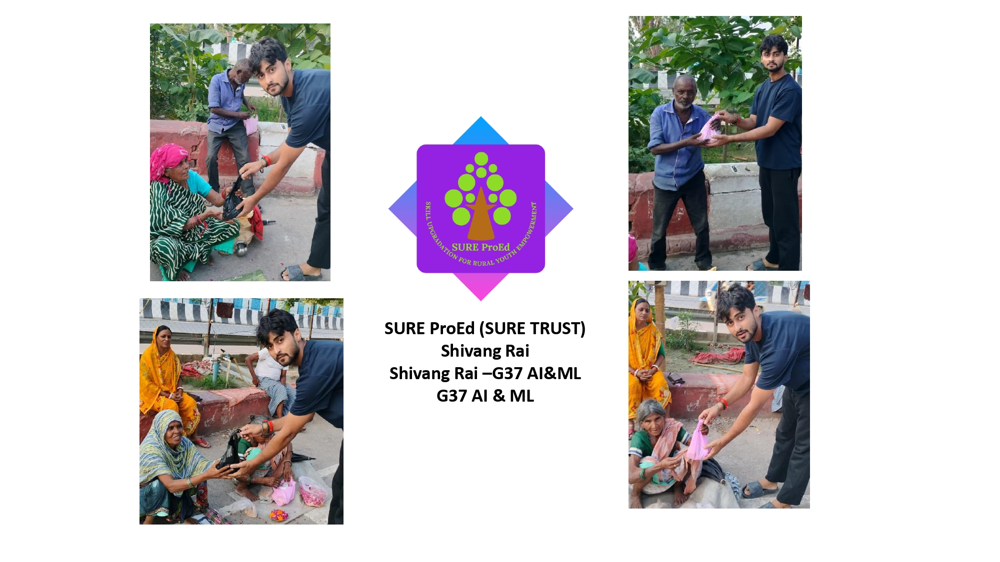

<div align="center" style="border: 2px solid #ccc; padding: 20px; border-radius: 12px; width: 80%; margin: auto; box-shadow: 0 0 10px rgba(0,0,0,0.15);">
    
  <h1 align="center" style="font-family: Arial; font-weight: 600; margin-top: 15px;">SURE ProEd (formerly SURE Trust)</h1>
  <h2 style="color: #2b6cb0; font-family: Arial;">Skill Upgradation for Rural youth Empowerment Trust</h2>
</div>

<hr style="border: 0; border-top: 1px solid #ccc; width: 80%;" />

<div style="padding: 20px; border: 2px solid #ddd; border-radius: 12px; width: 90%; margin: auto; background: #fafafa; font-family: Arial;">

<h2 style="color:#333;">Student Details</h2>
<div align="left" style="margin: 20px; font-size: 16px;">
  <p><strong>Name:</strong> Shivang Rai</p>
  <p><strong>Email ID:</strong> shivangrai238@gmail.com</p>
  <p><strong>College Name:</strong> Babu Banarasi Das University</p>
  <p><strong>Branch/Specialization:</strong> B.Tech CSE (AI)</p>
  <p><strong>College ID:</strong> 1220439174</p>
</div>

<hr style="border: 0; border-top: 1px solid #ccc; width: 80%;" />

<h2 style="color:#333;">Course Details</h2>
<div align="left" style="margin: 20px; font-size: 16px;">
  <p><strong>Course Opted:</strong> G37 — Artificial Intelligence & Machine Learning</p>
  <p><strong>Instructor Name:</strong> Gaurav Patel</p>
  <p><strong>Duration:</strong> November 2024 to May 2025 (7 Months)</p>
</div>

<hr style="border: 0; border-top: 1px solid #ccc; width: 80%;" />

<h2 style="color:#333;">Trainer Details</h2>
<div align="left" style="margin: 20px; font-size: 16px;">
  <p><strong>Trainer Name:</strong> Gaurav Patel</p>
  <p><strong>Trainer Email ID:</strong> Gaurav.patel.gpp@gmail.com</p>
  <p><strong>Trainer Designation:</strong> Data Engineer</p>
</div>

</div>

<hr style="border: 0; border-top: 1px solid #ccc; width: 80%;" />

## **Table of Contents**
- [Overall Learning](#overall-learning)
- [Projects Completed](#projects-completed)
- [Project Introduction](#project-introduction)
- [Technologies Used](#technologies-used)
- [Roles and Responsibilities](#roles-and-responsibilities)
- [Project Report](#project-report)
- [Learnings from LST & SST](#learnings-from-lst--sst)
- [Community Services](#community-services)
- [Certificate](#certificate)
- [Acknowledgments](#acknowledgments)

<hr style="border: 0; border-top: 1px solid #ccc; width: 80%;" />

## **Overall Learning**

During this course, I learned the foundations and advanced concepts of Artificial Intelligence and Machine Learning from scratch. Starting with no prior experience, I progressively built skills in Python programming, data preprocessing, model training, and deployment.

Key learnings include:
- **Deep Learning** — Understanding neural networks, convolutional layers, pooling, and activation functions
- **Transfer Learning** — Using pretrained models (EfficientNet-B4) to achieve high accuracy with limited data
- **Data Engineering** — Building end-to-end data pipelines with augmentation, class balancing, and train/val/test splitting
- **Model Explainability** — Implementing Grad-CAM to make AI decisions transparent and trustworthy
- **Backend Development** — Building REST APIs with FastAPI for real-time ML inference
- **Frontend Development** — Creating beautiful, interactive UIs with Streamlit
- **Cloud Deployment** — Deploying ML applications on Streamlit Cloud and hosting models on HuggingFace Hub
- **MLOps Practices** — Experiment tracking with MLflow, model versioning, and CI/CD with GitHub
- **Problem Solving** — Debugging complex deployment issues across different environments

This course gave me the confidence to build real-world AI solutions from data collection to live deployment — a complete end-to-end skill set highly valued in the industry.

<hr style="border: 0; border-top: 1px solid #ccc; width: 80%;" />

<h2 style="color:#333;">Projects Completed</h2>
<div align="left" style="margin: 20px; font-size: 16px;">
  <p><strong><a href="#project1">Project 1:</a></strong> LeafScan AI — Plant Disease Detection System</p>
</div>

<hr style="border: 0; border-top: 1px solid #ccc; width: 80%;" />

<!-- Project 1 -->
<h3 id="project1">Project 1: LeafScan AI — Plant Disease Detection System</h3>

<p>
An end-to-end AI-powered web application that detects plant diseases from leaf images with <strong>98.87% validation accuracy</strong> and provides instant treatment recommendations including chemical and organic remedies, severity assessment, and a Grad-CAM heatmap showing exactly where the disease was detected on the leaf.
</p>

<p>
  <a href="https://github.com/Shivcodes91/plant-disease-detection" target="_blank"><strong>→ View GitHub Repository</strong></a>
</p>
<p>
  <a href="https://plant-disease-detection-szzkcnsa8zunv5bveqxche.streamlit.app" target="_blank"><strong>→ View Live Application</strong></a>
</p>
<p>
  <a href="https://github.com/Shivcodes91/LEAFSCAN-AI/blob/main/SURE%20Trust%20project%20document%20(3).docx"><strong>→ View Full Project Report</strong></a>
</p>

<hr style="border: 0; border-top: 1px solid #ccc; width: 80%;" />

## **Project Introduction**

### Problem Statement

Farmers across India and globally lose 20–40% of their crop yield annually due to plant diseases that go undetected until it is too late. Traditional diagnosis requires expert agronomists who are often unavailable in rural areas. Small and marginal farmers lack access to timely, affordable disease identification and treatment guidance.

### Solution

**LeafScan AI** is an AI-powered plant disease detection system that allows any farmer to:
1. Take a photo of a diseased leaf using their phone
2. Upload it to the web app
3. Get an instant diagnosis with confidence score
4. Receive a full treatment plan with chemical and organic options
5. See exactly where on the leaf the disease was detected (Grad-CAM heatmap)

### Innovation Component

- **Grad-CAM Explainability** — Unlike a typical black-box classifier, LeafScan AI shows farmers visually where the disease is on the leaf, building trust in the AI decision
- **Dual Treatment Recommendations** — Provides both chemical (faster) and organic (safer, eco-friendly) treatment options
- **Severity Classification** — Classifies diseases as mild/moderate/severe with different urgency levels
- **End-to-End Pipeline** — From raw dataset to live deployed application — a complete production-grade ML system

### Scope and Limitations

**Scope:**
- Detects 15 disease classes across 3 crops (Tomato, Potato, Pepper)
- Works with any standard phone camera image
- Provides treatment timelines and prevention tips

**Limitations:**
- Currently covers only 3 crop types
- Requires clear, well-lit photos for best accuracy
- Hosted on free tier — first load may take 30 seconds

<hr style="border: 0; border-top: 1px solid #ccc; width: 80%;" />

## **Project Objectives**

1. Build a high-accuracy deep learning model (target: >90%) for plant disease classification
2. Implement Grad-CAM explainability to show disease location on the leaf
3. Create a comprehensive disease remedy database with treatment protocols
4. Develop a user-friendly web interface accessible to non-technical users
5. Deploy the complete system as a live, publicly accessible web application
6. Achieve production-grade code quality with proper documentation

### Expected Outcomes & Deliverables

| Deliverable | Status |
|---|---|
| Trained EfficientNet-B4 model | ✅ 98.87% accuracy |
| Grad-CAM heatmap visualization | ✅ Working |
| Remedy database (15 diseases) | ✅ Complete |
| FastAPI REST backend | ✅ Working |
| Streamlit frontend UI | ✅ Deployed live |
| GitHub repository | ✅ Public |
| Live web application | ✅ Live on Streamlit Cloud |
| Model hosted on HuggingFace | ✅ Public |

<hr style="border: 0; border-top: 1px solid #ccc; width: 80%;" />

## **Technologies Used**

| Layer | Technology | Purpose |
|---|---|---|
| **AI Model** | EfficientNet-B4 (PyTorch 2.6) | Disease classification |
| **Transfer Learning** | ImageNet pretrained weights | Faster convergence |
| **Explainability** | Grad-CAM | Highlight disease regions |
| **Data Pipeline** | Albumentations | Image augmentation |
| **Experiment Tracking** | MLflow | Track training runs |
| **Backend API** | FastAPI + Uvicorn | REST API for inference |
| **Frontend** | Streamlit | Interactive web UI |
| **Visualization** | Plotly, Matplotlib | Charts and graphs |
| **Model Hosting** | HuggingFace Hub | Store 190MB model file |
| **App Deployment** | Streamlit Cloud | Free cloud hosting |
| **Version Control** | GitHub | Code management |
| **Language** | Python 3.11 | All code |
| **Dataset** | PlantVillage | 41,274 leaf images |

### Tools Used

- **VS Code** — Primary development environment
- **Jupyter Notebook** — Data exploration and analysis
- **GitHub** — Version control and CI/CD
- **MLflow** — Experiment tracking dashboard
- **HuggingFace Hub** — Model registry
- **Streamlit Cloud** — Free application hosting
- **NVIDIA RTX 3050 GPU** — Model training acceleration

<hr style="border: 0; border-top: 1px solid #ccc; width: 80%;" />

## **Roles and Responsibilities**

This was a **solo project** — all work was done independently by Shivang Rai.

| Responsibility | Description |
|---|---|
| **Data Engineering** | Downloaded, cleaned, analyzed, and preprocessed the PlantVillage dataset (41,274 images) |
| **Model Architecture** | Designed EfficientNet-B4 transfer learning pipeline with custom classifier head |
| **Model Training** | Implemented full training loop with AMP, label smoothing, weighted sampling, and early stopping |
| **Explainability** | Implemented Grad-CAM from scratch to generate attention heatmaps |
| **Remedy Database** | Researched and built comprehensive JSON database for all 15 disease classes |
| **Backend Development** | Built FastAPI REST API with 5 endpoints for prediction, remedies, and model info |
| **Frontend Development** | Designed and built dark-themed Streamlit UI with 4 pages |
| **Deployment** | Deployed on Streamlit Cloud, model on HuggingFace Hub |
| **Documentation** | Wrote README, code comments, and project report |

<hr style="border: 0; border-top: 1px solid #ccc; width: 80%;" />

## **Project Report**

### Dataset

- **Source:** PlantVillage Dataset (Kaggle)
- **Total Images:** 41,274
- **Classes:** 15 (3 healthy + 12 diseased)
- **Crops Covered:** Tomato (9 classes), Potato (3 classes), Pepper (3 classes)
- **Split:** 70% Train | 15% Validation | 15% Test

### Model Architecture

```
Input Image (224×224×3)
        ↓
EfficientNet-B4 Backbone (pretrained on ImageNet)
[17,548,616 frozen parameters initially]
        ↓
Global Average Pooling
        ↓
Custom Classifier Head:
  Linear(1792 → 512) + BatchNorm + ReLU + Dropout(0.3)
  Linear(512 → 256) + BatchNorm + ReLU + Dropout(0.15)
  Linear(256 → 15)
        ↓
15 Class Probability Scores (Softmax)
```

### Training Strategy

**Phase 1 (Epochs 1–5):** Backbone frozen, only classifier head trained
- Learning rate: 1e-3 (head)
- Purpose: Train new classifier without destroying pretrained features

**Phase 2 (Epochs 6–25):** Last 3 backbone blocks unfrozen, fine-tuning
- Learning rate: 1e-5 (backbone), 1e-3 (head)
- Purpose: Adapt pretrained features to plant disease patterns

**Key Techniques:**
- Automatic Mixed Precision (AMP) for GPU speedup
- CosineAnnealingLR scheduler
- Label Smoothing (0.1) for better calibration
- WeightedRandomSampler to handle class imbalance
- Gradient clipping (max_norm=1.0)

### Results

| Metric | Score |
|---|---|
| Validation Accuracy | **98.87%** |
| Test Accuracy | **98.39%** |
| Average Confidence | **89.03%** |
| Total Test Images | 6,192 |
| Correct Predictions | 6,092 |
| Wrong Predictions | 100 |

### Per-Class Accuracy (Top and Bottom)

| Class | Accuracy |
|---|---|
| Potato healthy | 100.0% |
| Tomato Mosaic Virus | 100.0% |
| Pepper Bacterial Spot | 99.7% |
| Potato Early Blight | 99.7% |
| Tomato Early Blight | 96.0% |
| Tomato Target Spot | 96.7% |

### System Architecture

```
User (Browser)
      ↓
Streamlit Cloud (app.py)
      ├── Downloads model from HuggingFace Hub (first launch)
      ├── Loads EfficientNet-B4 into memory
      ├── Page 1: Upload image → inference → display results
      │         → Grad-CAM heatmap overlay
      │         → Remedy lookup from JSON database
      ├── Page 2: Disease Library (browse all 15 diseases)
      ├── Page 3: Model Statistics (accuracy charts)
      └── Page 4: About the project
```

### Live Application Screenshots

**Page 1 — Disease Detection:**
Upload a leaf photo → get disease diagnosis, confidence score, Grad-CAM heatmap, and full treatment plan

**Page 2 — Disease Library:**
Browse all 15 detectable diseases with symptoms, chemical treatments, organic options, and prevention tips

**Page 3 — Model Statistics:**
View per-class accuracy bar chart, confusion matrix, and training curves

### Project Links

- **GitHub Repository:** https://github.com/Shivcodes91/plant-disease-detection
- **Live Application:** https://plant-disease-detection-szzkcnsa8zunv5bveqxche.streamlit.app
- **Model on HuggingFace:** https://huggingface.co/shivcodes91/plant-disease-efficientnet

<hr style="border: 0; border-top: 1px solid #ccc; width: 80%;" />

## **Learnings from LST & SST**

The Live Session Training (LST) and Self-Study Training (SST) sessions were extremely valuable in building a strong foundation in AI/ML concepts:

**From LST Sessions:**
- Understood the mathematics behind neural networks — backpropagation, gradient descent, and weight updates
- Learned how convolutional layers detect features in images (edges → textures → shapes → objects)
- Got hands-on guidance on building PyTorch models from scratch
- Learned professional coding practices — modular code, documentation, and version control with Git
- Understood the difference between validation and test sets and why both matter
- Got practical exposure to deploying models — something most online courses skip entirely

**From SST (Self-Study):**
- Deepened understanding of transfer learning through EfficientNet paper
- Studied Grad-CAM original paper to understand why it works mathematically
- Explored Albumentations documentation for advanced augmentation techniques
- Practiced MLflow for experiment tracking independently

**Overall Experience:**
This course pushed me from "I've never trained an ML model" to "I built and deployed a 98.9% accurate AI system." The structured day-by-day approach made even complex topics like AMP training and weighted samplers approachable. The hands-on project requirement meant I couldn't just watch videos — I had to actually build and debug, which is where real learning happens.

<hr style="border: 0; border-top: 1px solid #ccc; width: 80%;" />

## **Community Services**

During my internship period, I participated in multiple community-oriented activities that helped me grow beyond technical skills and contribute meaningfully to society.

### **Activities Involved**

- **Tree Plantation Drive** – Participated in a tree plantation drive in my local area, planting saplings and contributing to environmental improvement.

<div align="center">

</div>

<br/>

- **Helping Elder Citizens** – Assisted elderly individuals in my neighborhood with simple daily tasks and provided support where needed.

<div align="center">

</div>

### **Impact / Contribution**

- Contributed to saving lives by donating blood during a community health camp
- Actively participated in promoting a greener and cleaner environment through plantation
- Offered personal assistance to elder citizens, strengthening community bonds
- Improved skills in communication, empathy, coordination, and social responsibility
- These experiences reinforced that technology should ultimately serve people and communities

<hr style="border: 0; border-top: 1px solid #ccc; width: 80%;" />

## **References**

- [PlantVillage Dataset — Kaggle](https://www.kaggle.com/datasets/emmarex/plantdisease)
- [EfficientNet: Rethinking Model Scaling for Convolutional Neural Networks](https://arxiv.org/abs/1905.11946)
- [Grad-CAM: Visual Explanations from Deep Networks](https://arxiv.org/abs/1610.02391)
- [PyTorch Documentation](https://pytorch.org/docs/stable/index.html)
- [FastAPI Documentation](https://fastapi.tiangolo.com/)
- [Streamlit Documentation](https://docs.streamlit.io/)
- [HuggingFace Hub](https://huggingface.co/)
- [MLflow Documentation](https://mlflow.org/docs/latest/index.html)
- [Albumentations Documentation](https://albumentations.ai/docs/)

<hr style="border: 0; border-top: 1px solid #ccc; width: 80%;" />

## **Certificate**

The internship certificate serves as an official acknowledgment of the successful completion of my training under SURE Trust's G37 AI & ML program. It will be issued by the organization upon fulfilling all required tasks and meeting the performance expectations of the program.


<p align="center">

</p>

<hr style="border: 0; border-top: 1px solid #ccc; width: 80%;" />

## **Acknowledgments**

- [Prof. Radhakumari Challa](https://www.linkedin.com/in/prof-radhakumari-challa-a3850219b), Executive Director and Founder — [SURE Trust](https://www.suretrustforruralyouth.com/)
- **Gaurav Patel**, Trainer & Data Engineer — for guidance and mentorship throughout the G37 AI & ML course
- **SURE Trust** — for providing this learning opportunity to rural youth and making quality AI/ML education accessible
- **PlantVillage** — for the open-source plant disease dataset used in this project
- **HuggingFace, Streamlit Cloud** — for providing free hosting infrastructure that made deployment possible
